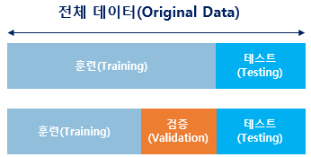

## **1. 머신 러닝 워크플로우(Machine Learning Workflow)**

데이터를 수집하고 머신 러닝을 하는 과정을 크게 6가지로 나누면, 아래의 그림과 같습니다.

### **1) 수집(Acquisition)**

머신 러닝을 하기 위해서는 기계에 학습시켜야 할 데이터가 필요합니다. 자연어 처리의 경우, 자연어 데이터를 **말뭉치 또는 코퍼스(corpus)**라고 부르는데 코퍼스의 의미를 풀이하면, 조사나 연구 목적에 의해서 특정 도메인으로부터 수집된 텍스트 집합을 말합니다. 코퍼스. 즉, 텍스트 데이터의 파일 형식은 txt 파일, csv 파일, xml 파일 등 다양하며 그 출처도 음성 데이터, 웹 수집기를 통해 수집된 데이터, 영화 리뷰 등 다양합니다.

### 2) 점검 및 탐색(Inspection and exploration)**

데이터가 수집되었다면, 이제 데이터를 점검하고 탐색하는 단계입니다. 여기서는 데이터의 구조, 노이즈 데이터, 머신 러닝 적용을 위해서 데이터를 어떻게 정제해야하는지 등을 파악해야 합니다. 이 단계를 **탐색적 데이터 분석(Exploratory Data Analysis, EDA) 단계**라고도 하는데 이는 독립 변수, 종속 변수, 변수 유형, 변수의 데이터 타입 등을 점검하며 데이터의 특징과 내재하는 구조적 관계를 알아내는 과정을 의미합니다. 이 과정에서 시각화와 간단한 통계 테스트를 진행하기도 합니다.

### 3) 전처리 및 정제(Preprocessing and Cleaning)**

데이터에 대한 파악이 끝났다면, 머신 러닝 워크플로우에서 가장 까다로운 작업 중 하나인 데이터 전처리 과정에 들어갑니다. 이 단계는 많은 단계를 포함하고 있는데, 가령 자연어 처리라면 토큰화, 정제, 정규화, 불용어 제거 등의 단계를 포함합니다. 빠르고 정확한 데이터 전처리를 하기 위해서는 사용하고 있는 툴(이 책에서는 파이썬)에 대한 다양한 라이브러리에 대한 지식이 필요합니다. 정말 까다로운 전처리의 경우에는 전처리 과정에서 머신 러닝이 사용되기도 합니다.

### **4) 모델링 및 훈련(Modeling and Training)**

데이터 전처리가 끝났다면, 머신 러닝에 대한 코드를 작성하는 단계인 모델링 단계에 들어갑니다. 적절한 머신 러닝 알고리즘을 선택하여 모델링이 끝났다면, 전처리가 완료 된 데이터를 머신 러닝 알고리즘을 통해 기계에게 학습(training)시킵니다. 이를 훈련이라고도 하는데, 이 두 용어를 혼용해서 사용합니다. 기계가 데이터에 대한 학습을 마치고나서 훈련이 제대로 되었다면 그 후에 기계는 우리가 원하는 태스크(task)인 기계 번역, 음성 인식, 텍스트 분류 등의 자연어 처리 작업을 수행할 수 있게 됩니다.

여기서 주의해야할 점은 대부분의 경우에서 모든 데이터를 기계에게 학습시켜서는 안 된다는 점입니다. 뒤의 머신 러닝, 딥 러닝 챕터에서 실제로 보게되겠지만 데이터 중 일부는 테스트용으로 남겨두고 훈련용 데이터만 훈련에 사용해야 합니다. 그래야만 기계가 학습을 하고나서, 현재 성능이 얼마나 되는지를 측정할 수 있으며 과적합(overfitting) 상황을 막을 수 있습니다. 데이터의 양이 충분하여 더 세부적으로 나눌 수 있다면 훈련용, 검증용, 테스트용. 데이터를 이렇게 세 가지로 나누고 훈련용 데이터만 훈련에 사용하기도 합니다.

검증용과 테스트용의 차이는 무엇일까요? 수능 시험에 비유하자면 훈련용은 학습지, 검증용은 모의고사, 테스트용은 수능 시험이라고 볼 수 있습니다. 학습지를 풀고 수능 시험을 볼 수도 있겠지만, 모의 고사를 풀며 부족한 부분이 무엇인지 검증하고 보완하는 단계를 하나 더 놓는 방법도 있겠지요. 사실 현업의 경우라면 검증용 데이터는 거의 필수적입니다. 검증용 데이터는 현재 모델의 성능. 즉, 기계가 훈련용 데이터로 얼마나 제대로 학습이 되었는지를 판단하는 용으로 사용되며 검증용 데이터를 사용하여 모델의 성능을 개선하는데 사용됩니다. 테스트용 데이터는 모델의 최종 성능을 평가하는 데이터로 모델의 성능을 개선하는 일에 사용되는 것이 아니라, 모델의 성능을 수치화하여 평가하기 위해 사용됩니다. 쉽게 말해 시험에 비유하면 이제는 채점하는 단계입니다. 이에 대한 내용은 뒤에서 다시 다룹니다.

### **5) 평가(Evaluation)**

위에서 검증용 데이터와 테스트용 데이터의 차이를 설명하기 위해서 미리 언급하였는데, 기계가 다 학습이 되었다면 테스트용 데이터로 성능을 평가하게 됩니다. 평가 방법은 기계가 예측한 데이터가 테스트용 데이터의 실제 정답과 얼마나 가까운지를 측정합니다.

### **6) 배포(Deployment)**

평가 단계에서 기계가 성공적으로 훈련이 된 것으로 판단된다면, 완성된 모델이 배포되는 단계가 됩니다. 다만, 여기서 완성된 모델에 대한 전체적인 피드백에 대해서 모델을 변경해야하는 상황이 온다면 다시 처음부터 돌아가야 하는 상황이 올 수 있습니다.

그림에서는 언제든 다시 처음부터 돌아갈 수 있다는 의미에서 배포 단계에서 화살표를 수집 단계로 그렸지만, 실제로는 거의 모든 단계에서 전 단계로 돌아가는 상황이 발생할 수 있습니다.

< 출처 >

https://wikidocs.net/31947

